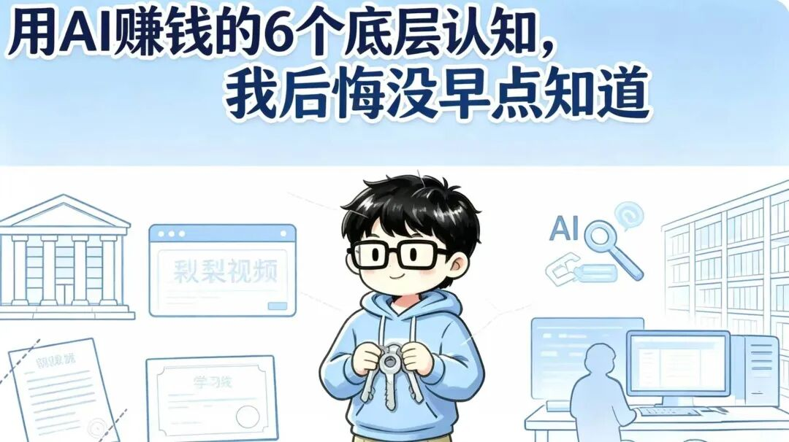
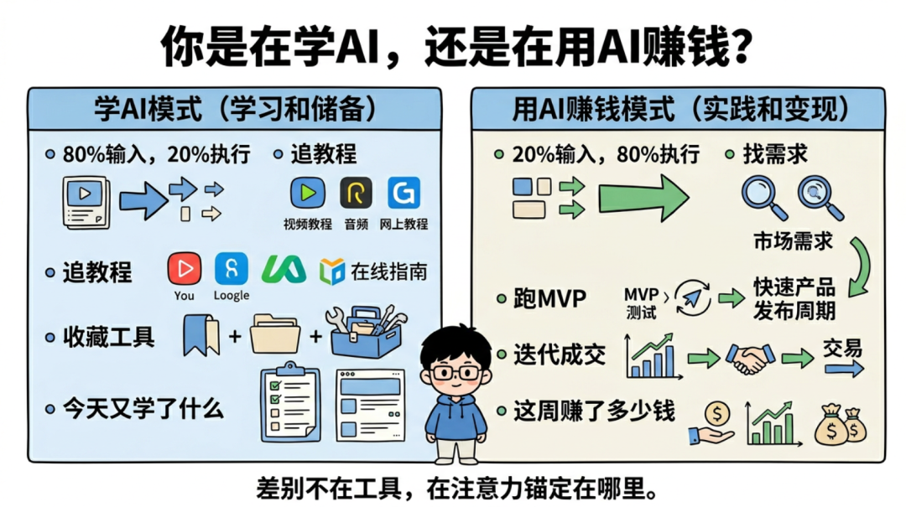
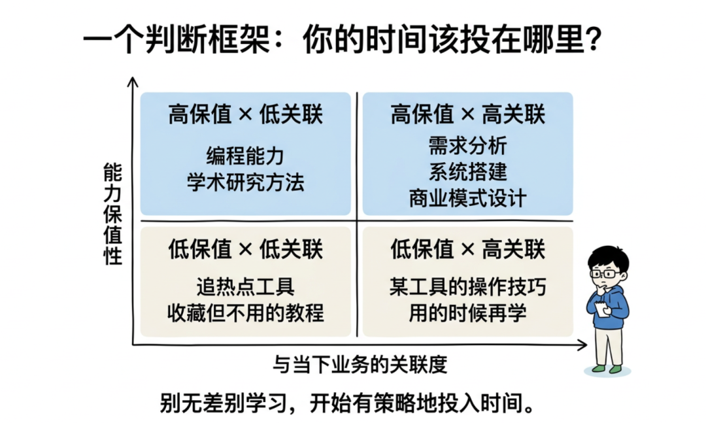
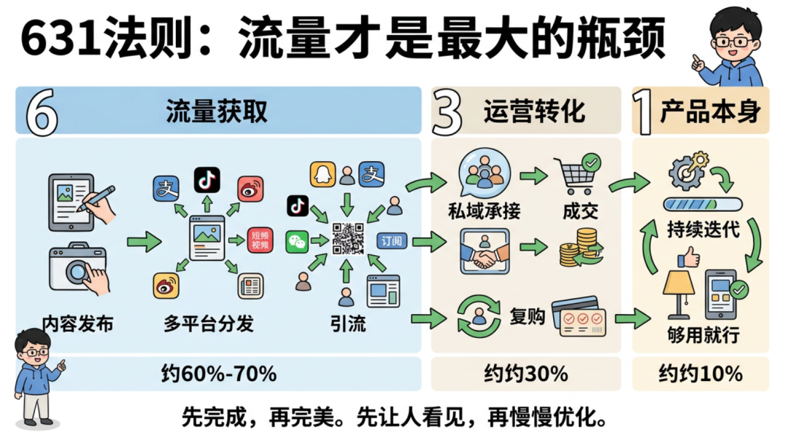
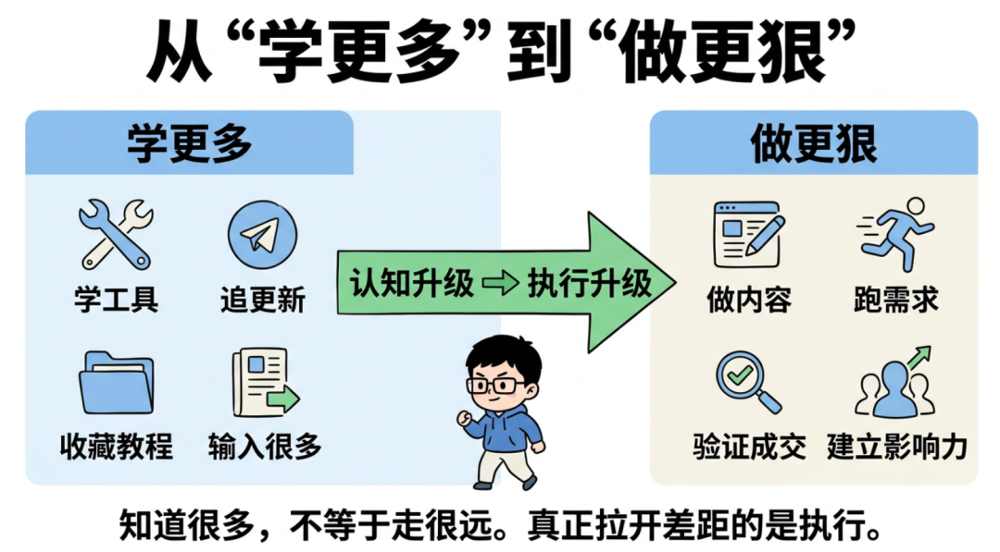

# 用AI的6个底层认知，我后悔没早点知道

**Hi，我是Kunki。**
一个普通大学生，在AI浪潮中寻找象牙塔外的答案。
昨晚听了一场闭门分享会，两个多小时，200多人在线，信息密度大到我全程没敢走神。
听完之后我没有急着睡觉，而是把录音重新过了一遍，边听边记，把那些真正击中我的点一个一个抠出来。
不是那种"哇好有道理"然后第二天就忘了的触动，而是那种——你听完之后沉默了很久，然后开始反思自己过去几个月到底在干什么的触动。
**今天这篇文章，我想把这些思考完整地写出来。不是转述别人的观点，而是结合我自己的真实经历，聊聊这场分享到底改变了我哪些认知。**
如果你也在做AI相关的事情，或者你和我一样是个普通大学生，正在这个时代里摸索自己的路，我觉得这篇文章值得你花五分钟读完。
## 一、你是在"学AI"，还是在"用AI赚钱"？
这是整场分享里最先击中我的一个问题。
说实话，听到这个问题的时候，我心里咯噔了一下。因为我知道，我自己在很长一段时间里，就是那个典型的`学AI`选手。
什么意思呢？
就是每天刷各种AI工具的更新，今天出了个新模型赶紧去试试，明天出了个新功能赶紧去体验一下，收藏了一堆提示词模板、教程合集、工具清单。感觉自己每天都在进步，每天都在学东西。
但如果有人问我：**你这个月靠AI赚了多少钱？**
我会沉默。
分享里有一句话让我印象特别深——
**"不要做AI的学生，要做AI的老板。**
**学生永远在交学费，老板在收钱。"**
这句话很直白，甚至有点扎心，但你仔细想想，它描述的就是绝大多数人的状态。
我把这两种模式做了个对比，你可以对号入座看看自己属于哪一种：
`**学AI**`**模式：**80%的时间在输入，20%在执行。核心动作是追教程、收藏工具。衡量标准是"我今天又学了什么新东西"。信息筛选的逻辑是什么火看什么。
`**用AI赚钱**`**模式：**20%的时间在输入，80%在执行。核心动作是找需求、跑MVP、迭代成交。衡量标准是"这周多赚了多少钱"。信息筛选的逻辑是什么离钱近看什么。
差别在哪？差别在你的注意力到底锚定在`工具`上，还是锚定在`商业结果`上。
我之前做AI内容的时候，经常会纠结一个问题：我该用哪个AI工具？哪个效果更好？哪个出图更精致？
现在回头看，这些问题本身就是错的。工具是手段，不是目的。你用Midjourney*()*还是用DALL-E，对你的读者来说根本不重要，他们在乎的是你的内容能不能帮到他们、你的产品能不能解决他们的问题。

分享里还提到一个概念叫`**荷塘效应**`，我觉得特别形象：荷叶的面积每天翻一倍，到第29天才铺满半个池塘，但第30天就铺满了整个池塘。大部分人在第20天就放弃了，因为看起来"什么都没发生"。
这个比喻让我想到了我自己做自媒体的经历。最开始发内容的时候，阅读量很低，互动很少，感觉在自言自语。但我知道，只要方向是对的，这些积累终究会指数级爆发。前提是——你得撑到第29天。
但"撑"的方式不是每天刷教程让自己感觉在进步，而是**每天真正在做、在产出、在离商业结果更近一步。**
分享里还提到了一个案例，有人用Claude*()*从第1版一直用到第57版，每一版都在深度使用、持续反馈。这种状态才是真正的学以致用——不是什么都浅尝辄止，而是在一个工具上打深、打透，形成自己的工作流。
这一点对我的触动很大。我之前确实是那种"每个工具都试试"的状态，但深度不够。接下来我决定在Claude和几个核心工具上做深度投入，把它们真正变成我的生产力杠杆，而不是收藏夹里的装饰品。
## 二、普通人翻盘，靠的不是天赋，是窗口期
分享里讲了好几个真实案例，都是普通人起步，靠AI工具撬动了商业结果。
有一个人原本是普通上班族，月薪三五千。他用AI工具批量运营了500多个账号的内容矩阵，现在月入10万以上。不是因为他的内容有多精致，而是他有`流量思维`，并且系统化地执行了。
还有一个做海外内容的，用AI生成内容发YouTube，半年累计播放超过4亿次，月收入大概8到10万人民币。关键不在于他的AI用得有多好，而在于他`选对了平台和赛道`，然后用AI把产量拉到了极致。
还有一个做AI英语学习小程序的，6个月2万多付费用户，月流水100万。用最轻量的方式验证需求，用AI降低开发和内容成本。
这些案例的共同点是什么？
不依赖天赋，不依赖资源，不依赖学历背景。靠的是三样东西：**窗口期、执行力、正确的方向。**
有一句话我反复咀嚼了很多遍——
**"普通人翻盘不是靠天赋，是靠窗口期。**
**AI就是这一代人的窗口期，但窗口不会永远开着。"**
这句话对我来说不是鸡汤，而是一个非常冷静的事实判断。
我是一个双非一本的大三学生，没有985的背景，没有大厂的实习，没有家里的资源。如果按传统的路径去卷，我的天花板其实看得见。
但AI这个东西，它重新洗了一次牌。它让很多原本需要团队、需要资金、需要技术背景才能做的事情，变成了一个人就能跑通。
我自己的经历就是最好的证明。我做AI相关的自媒体内容，从零开始，没花一分钱投流，纯靠内容本身慢慢积累起了一些粉丝基础。后来陆续有了品牌方的合作、AI垂直MCN的合作。这些机会不是因为我有什么特殊的资源，而是因为我在对的时间做了对的事情。
但听完这场分享我也意识到，**光做内容还不够，我需要更快地把流量转化成现金流。** 窗口期不会等人，现在最重要的事情是在窗口关闭之前，把商业模式跑通。
## 三、一个判断框架：你的时间该投在哪里？
分享里有一个框架让我觉得特别实用，我直接拿来用了。
它的逻辑是用两个维度来评估你当下该把时间投入到哪里——`能力保值性`和`与当下业务的关联度`。
能力保值性问的是：这个技能一年后还值钱吗？
与当下业务的关联度问的是：学了之后能马上用吗？

用这两个维度可以把所有的学习和投入分成四类：
**高保值 × 高关联** —— 比如需求分析、系统搭建、商业模式设计。这些能力不管工具怎么迭代都不会过时，而且马上就能用到你正在做的事情上。这是应该重点投入的。
**高保值 × 低关联** —— 比如底层编程能力、学术研究方法论。长远来看有价值，但当下不急，持续积累就好。
**低保值 × 高关联** —— 比如某个特定工具的操作技巧。用的时候再学就行，不要花大量时间去"储备"。
**低保值 × 低关联 —— 比如追热点工具、收藏用不到的教程。果断放弃。**
分享里举了一个特别生动的例子：Midjourney的提示词技巧。半年前这个特别火，很多人花了大量时间学习和积累。但模型升级之后，大量提示词直接失效了。这就是典型的`低保值`技能。
而`**需求分析能力**`**、**`**商业判断力**`**、**`**用户洞察力**`，这些东西不管工具怎么变，都不会过时。
这个框架对我最大的启发是：**停止无差别地学习，开始有策略地投入时间。**
我之前的问题就是什么都想学、什么都想试，结果每样都浅。现在我会先用这个框架过滤一遍——如果一个东西既不保值又跟我当下在做的事情关联度不高，那它再火我也不碰。
## 四、631法则——流量才是最大的瓶颈
这是分享里让我直接调整了执行策略的一个方法论。
`**631法则**`：60%-70%的精力放在流量获取上，30%放在运营和转化，只留10%给产品本身。
第一次听到这个比例的时候，我是有点惊讶的。因为我之前的本能反应是——产品不应该最重要吗？产品做好了，用户自然就来了啊？
但仔细一想，这个认知是错的。
至少在轻交付模式下——比如卖数字产品、课程、工具使用权这类东西——产品足够标准化之后，真正的瓶颈不是产品本身，而是流量。你东西再好，没人知道，等于不存在。

分享里举了一个特别接地气的例子：卖API账号。
整个链路是这样的：`**发现需求**`** → **`**做内容拿流量**`** → **`**引流到私域**`** → **`**成交转化**`** → **`**复购+口碑裂变**`
整个链路里，最重要的环节是什么？是第二步——**做内容拿流量**。
内容不需要多精致，但要`持续`、`稳定`、`有信息增量`。
这一点我深有体会。我自己做内容的时候，有时候会陷入一个误区——花大量时间打磨一篇文章的排版、措辞、配图，追求"完美"。但实际上，发出去就已经赢了。因为90%的人连"发出去"这一步都做不到。
**"先完成再完美。完成本身就是竞争力，**
**因为90%的人连完成都做不到。"**
这句话我打算打印出来贴在桌子上。
基于631法则，我接下来的执行策略要做一个明确的调整：把大部分精力从"产品打磨"转移到"流量获取"上。具体来说，就是增加内容的发布频率和分发渠道，先把流量跑起来，产品在过程中迭代。
## 五、PRD思维——和AI对话的正确姿势
这一点可能偏"技术流"一些，但我觉得对任何一个日常使用AI的人来说都非常重要。
大部分人和AI对话的方式是什么？是"许愿式"的。
"帮我写个文案。"
然后AI给你一个很泛的结果，你不满意，追问，再不满意，再追问，来来回回折腾半天，最后勉强凑合用。
分享里提出的方法是——用`PRD思维`和AI对话。PRD就是产品需求文档，是产品经理用来描述需求的标准化格式。
核心逻辑就是：**在和AI对话之前，先花5分钟把需求想清楚、写清楚。** 包括背景是什么、目标用户是谁、风格是什么、字数大概多少、有没有参考案例。
这看起来是多花了5分钟，但实际上能省你30分钟的反复追问时间，而且输出质量会高一个量级。
❌ **低效的方式是：一句话丢给AI → 不满意 → 反复追问 → 浪费大量时间。**
**✅ 高效的方式是：先想清楚 → 写清需求 → 一次高质量输出 → 微调即可。**
另一个配套的方法论是`先搜后做`——在动手之前，先让AI帮你搜索一下是否已经有类似的解决方案。GitHub上、ProductHunt*()*上、各种开源社区里，大量问题已经有人解决了。拿来改比从零做效率高10倍。
还有一个观点我觉得特别反直觉但特别对：**AI时代，你需要掌握的核心技能反而更少了。** 以前可能需要80多个技能才能运转一个项目，现在只需要精通10到20个核心技能，其余的都可以交给AI。关键是搞清楚哪些是你必须亲自掌握的核心能力，哪些可以放心地外包给AI。
对我来说，必须亲自掌握的核心能力是：`内容策划`、`需求洞察`、`商业判断`、`用户沟通`。这些是AI替代不了的。而具体的执行层面——比如初稿生成、数据整理、格式排版——这些完全可以交给AI来加速。
## 六、以终为始——商业模式比工具重要一万倍
这是整场分享里我觉得含金量最高的部分。
一句话总结就是：**工具会过时，商业逻辑不会。**
不管AI工具怎么迭代，底层的商业规律是不变的。你需要思考的不是"我该用哪个AI工具"，而是"我的商业模式是否成立"。
怎么判断一个商业模式是否成立？分享里给了四个要素，我觉得每一个都值得反复琢磨：
**第一，需求。** 是否存在真实的、可付费的需求？注意这里的关键词是`可付费`。用户"想要"和"愿意掏钱"之间有巨大的鸿沟。很多人做的产品，用户确实觉得不错，但不错到愿意付费吗？这是两回事。还有一个很扎心的数据——每多一步操作，用户流失大约30%。所以链路要尽可能短。
**第二，链路。** 从用户知道你到用户付钱，中间经过几步？每一步的转化率是多少？能一步成交就别搞两步。减少中间环节是提高转化的最有效方式。
**第三，交付。** 产品或服务如何交付？是否可标准化？`交付成本`决定了你的商业模式是否可规模化。数字产品、SaaS、自动化服务的交付成本趋近于零，这就是为什么这些模式在AI时代特别有优势。
**第四，复购。** 用户买一次就结束，还是会持续付费？`复购率`决定了你的生意是"做一单赚一单"还是有长期价值。订阅模式、消耗品模式天然有复购优势。

"从市场需求倒推解决方案，而不是拿着锤子找钉子。工具只是手段，赚钱才是目的。"
这句话精准地描述了我之前的误区。我之前做事情的逻辑是：我会用这个AI工具 → 我用它做个产品 → 然后找人来买。
正确的逻辑应该反过来：市场上有什么需求 → 谁愿意为此付费 → 我怎么用最低成本满足这个需求。
这是一个根本性的思维转换。工具只是手段，赚钱才是目的。
很多人的误区是先做产品再找用户。花了三个月打磨产品，觉得"终于完美了"，结果推出去发现没人买。正确的顺序是：先验证需求，哪怕用最粗糙的方式，确认有人愿意付费，再投入时间和资源去打磨。
我自己现在在推的一些AI相关业务，就是按这个逻辑走的。先发了一些内容测试市场反应，发现确实有人有这个需求，先成交几单验证，然后再慢慢优化流程和服务。虽然还很初期，但至少方向是对的。
---

说实话，写到这里，我最大的感受不是"我又学到了好多东西"，而是——
**我知道的已经够多了，做的还不够狠。**
这场分享给我的不是新知识，而是一面镜子。它让我看清了自己过去几个月的状态：输入太多，执行太少；追工具太多，思考商业太少；追求完美太多，先完成太少。
接下来我给自己定了几个明确的行动方向：
**继续推进手上的AI业务**，重点放在流量获取上，按`631法则`重新分配精力。
**把现有的内容生产和发布流程梳理一遍**，找到可以用AI替代或加速的环节，提升单位时间的产出。
**养成**`**PRD思维**`**的习惯**，每次使用AI之前先花5分钟把需求写清楚，逐步形成自己的高效工作流。
**持续做有价值的内容输出**，像这篇复盘一样，帮助别人的同时也在建立自己的影响力。
最后分享一句话，也是这场分享里我最喜欢的一句：
**"成为一个一出现，必有好事发生的人。"**
这是最好的个人品牌策略。不是吹嘘自己有多厉害，而是每次出现都在创造价值、帮助别人。当你持续这样做的时候，机会自然会来找你。
我还在路上，希望和大家一起共勉。

